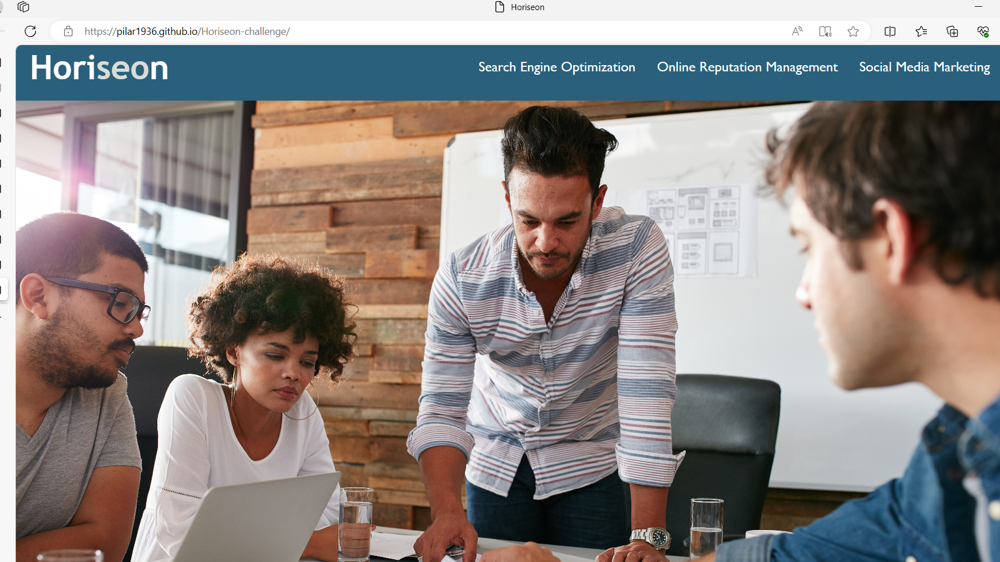
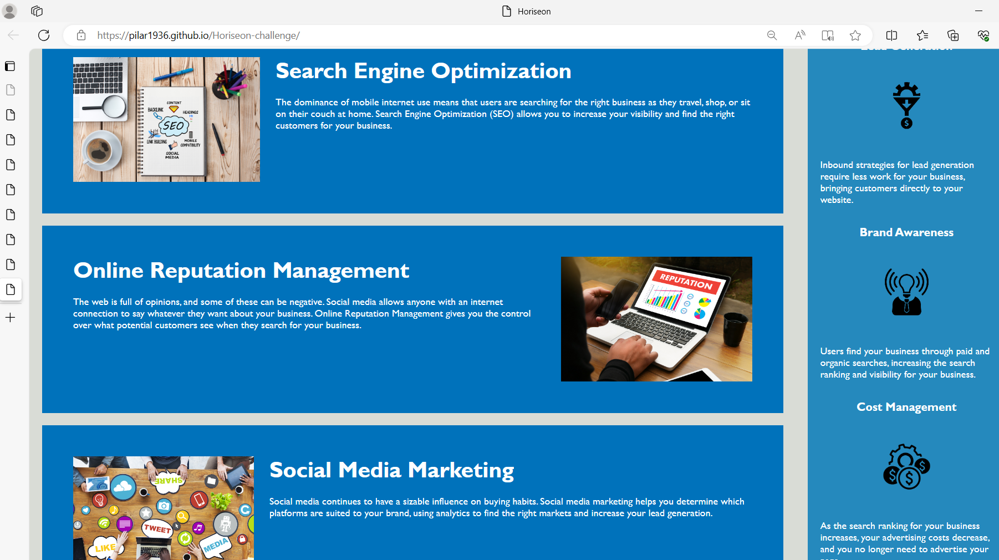

# Horiseon-challenge
 # Change
.cambien el titulo
.utilice semantica html como nav, main, article,section y aside.
.removed unnecesary class attribute.
#webpage and link 
https://pilar1936.github.io/Horiseon-challenge/

https://github.com/Pilar1936/Horiseon-challenge#change
 
 scresshot-horiseon 
 
